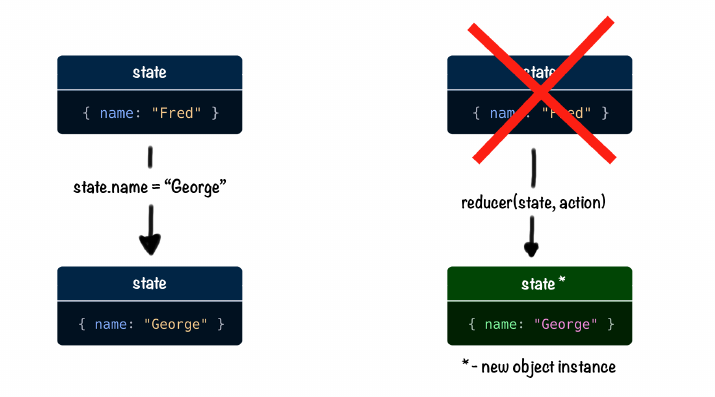

# Añadir estado global y lógica de negocio

Implementaremos el arrastrar y soltar usando la biblioteca de React DnD. Y añadiremos el estado de la gestión. No usaremos ningún marco externo como Redux o Mobx. En su lugar, vamos a montar una versión de Redux pobre usando el gancho useReducer y la API de  context de React. Antes de entrar en acción, daré una pequeña introducción al uso de UseReducer.

useReducer es un gancho de React que nos permite manejar estados complejos como objetos con múltiples campos. La idea principal es que en lugar de mutar el objeto original siempre creamos una nueva instancia con los valores deseados.



El estado se actualiza mediante una función especial llamada reductor. 

#### ¿Qué es el reductor?

 El reductor es una función que calcula un nuevo estado combinando un estado antiguo con un objeto de acción.


El reductor debe ser una función pura. Significa que no debe realizar ningún efecto secundario \(I/O operaciones, o modificando el estado global\) y para cualquier entrada dada debe devolver la la misma salida. 

#### ¿Qué son las acciones?

 Las acciones son objetos especiales que se pasan a la función reductora para calcular el nuevo estado. Las acciones deben contener un campo de tipo y algún campo para la carga útil. El campo de tipo es obligatorio. La carga útil a menudo tiene un nombre arbitrario. Aquí hay una acción que podría ser usada para actualizar el campo del nombre:

```javascript
{ type: "SET_NAME", name: "George" }
```

Puedes llamar a useReducer dentro de tus componentes funcionales. En cada cambio de estado, tu componente se volverá a reproducir. Aquí está la sintaxis básica:

```text
const [state, dispatch] = useReducer(reducer, initialState)
```

useReducer acepta un reductor y un estado inicial. Devuelve el estado actual emparejado con un método de envío. El método de envío se utiliza para enviar acciones al reductor.

