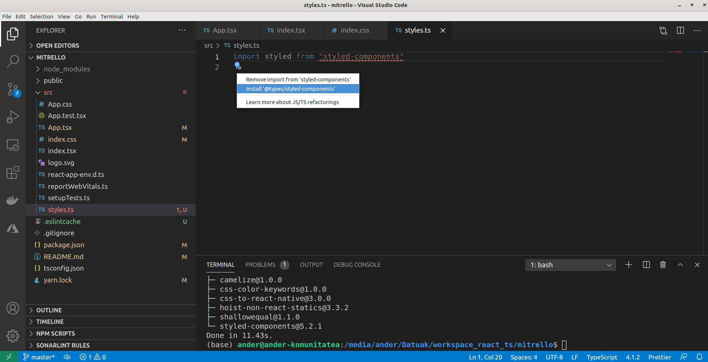

# Introducción

Crearemos una versión simplificada de una tabla kanban. Un ejemplo popular de tal aplicación es Trello.

En Trello, puedes crear tareas y organizarlas en listas. Puedes arrastrar ambas tarjetas y listas para reordenarlas. También puedes añadir comentarios y adjuntar archivos a tus tareas. En nuestra aplicación recrearemos sólo la funcionalidad principal: crear tareas, hacer listas y arrastrarlas.

## Creación del proyecto

```text
$ npx create-react-app mitrello --template typescript
```

Con Typescript - debes usar las extensiones .tsx en los archivos que tienen código JSX, y .ts en archivos que no.

### Estilos CSS

Podemos establecer los estilos principales de la aplicación en index.css

```css
html {
    box-sizing: border-box;
}
*, *:before, *:after {
    box-sizing: inherit;
}
html, body, #root {
    height: 100%
}
```

Hay muchas librerías que simplifican el trabajo con CSS en React. Me gusta usar Styles Components. Styled Components permite definir componentes reutilizables con estilos adjuntos. Más información en [https://styled-components.com/](https://styled-components.com/)

Para su instalación ejecutamos el siguiente comando:

```bash
$ yarn add styled-components
```

Por comodidad, pondremos todos los componentes generados por los componentes de estilo a styles.ts. Crea el archivo styles.ts. Ahora intenta importar los estilos de los componentes de estilo.

```typescript
import styled from "styled-components"
```



Debemos instalar los tipos de Typescript para styles components

Crearemos un conjunto de elementos contenedores:

* AppContainer - disponer las columnas horizontalmente
* ColumnContainer establecer el fondo gris y las esquinas redondeadas
* ColumnTitle - poner el título de la columna en negrita y añadir rellenos
* CardContainer

Necesitamos que el diseño de nuestra aplicación contenga una lista de columnas dispuestas horizontalmente. Usaremos flexbox para lograrlo.


```typescript
export const AppContainer = styled.div`
    align-items: flex-start;
    background-color: #3179ba;
    display: flex;
    flex-direction: row;
    height: 100%;
    padding: 20px;
    width: 100%;
`
```


Las funciones de los componentes de estilo aceptan cadenas con reglas CSS. Cuando usamos cadenas de estilo - podemos omitir los corchetes y sólo añadir la cadena al nombre de la función. 

Aquí especificamos la visualización: flex para que utilice el diseño del flexbox. Establecemos la propiedad flex-dirección a la fila, para disponer nuestros artículos horizontalmente. Y añadimos un relleno de 20px en su interior. 

Vamos a src/App.tsx e importe el AppContainer:


```typescript
import React from 'react';
import './App.css';
import { AppContainer } from "./styles"

const text: string = "Hola TypeScript"; 

function App() {
  return (
   <AppContainer>
      Las columnas van aquí
   </AppContainer>
  );
}

export default App;
```


#### Estilos para las columnas 

Hagamos que nuestro componente de la Columna se vea bien. Crear un componente ColumnContainer en src/styles.ts.


```typescript
export const ColumnContainer = styled.div`
    background-color: #ebecf0;
    width: 300px;
    min-height: 40px;
    margin-right: 20px;
    border-radius: 3px;
    padding: 8px 8px;
    flex-grow: 0;
`
```


Aquí especificamos un fondo gris, márgenes y acolchados y también especificamos flex-grow: 0 para que el componente no intente ocupar todo el espacio horizontal. 

Aún en src/styles.ts crear estilos para el título de la columna:

```typescript
export const ColumnTitle = styled.div`
    padding: 6px 16px 12px;
    font-weight: bold;
`
```

Lo usaremos para envolver el título de nuestra columna. 

#### Estilos para las cartas

Necesitaremos estilos para el componente de la tarjeta. Abre src/styles.ts y crea un nuevo un componente de estilo llamado CardContainer. No te olvides de exportarlo.

```typescript

export const CardContainer = styled.div`
    background-color: #fff;
    cursor: pointer;
    margin-bottom: 0.5rem;
    padding: 0.5rem 1rem;
    max-width: 300px;
    border-radius: 3px;
    box-shadow: #091e4240 0px 1px 0px 0px;
`
```

## Crear el componente de la columna 

Es hora de crear nuestro primer componente funcional. Empezaremos con el componente de la Columna. Crear un nuevo archivo src/Column.tsx.

```typescript
import React from "react";

export const Column = () => {
  return <div>Column Title</div>;
};
```

#### Actualizar la disposición de la columna

Ahora vamos a utilizar estos componentes de la envoltura en nuestra disposición de la columna:


```typescript
import React from "react";
import { ColumnContainer, ColumnTitle } from "./styles";
export const Column = () => {
  return (
    <ColumnContainer>
      <ColumnTitle>Column Title</ColumnTitle>
    </ColumnContainer>
  );
};

```


Queremos ser capaces de proporcionar el título de la columna usando props.  Veamos cómo usar los props con componentes funcionales. En Typescript, es necesario proporcionar un tipo o una interfaz para definir la forma de su Objeto de props. 

Para que la propiedad sea opcional, puede añadir un signo de interrogación antes de los dos puntos.

```typescript
import React from "react";
import { ColumnContainer } from "./styles";
interface ColumnProps {
  text?: string;
}
export const Column = ({ text }: ColumnProps) => {
  return (
    <ColumnContainer>
      <ColumnTitle>{text}</ColumnTitle>
    </ColumnContainer>
  );
};

```

## Renderizar a los elementos hijo dentro de las columnas

Ahora tenemos un componente de Tarjeta y un componente de Columna y podemos renderizar todo a la vez. Para ello, pasaremos los componentes de la Tarjeta niños a los componentes de la Columna. Ve a src/Column.tsx y modifica el componente:

```typescript
import React from "react";
import { ColumnContainer, ColumnTitle } from "./styles";
interface ColumnProps {
  text: string;
}
export const Column = ({
  text,
  children,
}: React.PropsWithChildren<ColumnProps>) => {
  return (
    <ColumnContainer>
      <ColumnTitle>{text}</ColumnTitle>
      {children}
    </ColumnContainer>
  );
};
```

Aquí usamos el tipo React.PropsWithChildren que puede realzar tus propiedades y añadir una definición para los elementos hijos.

## Crear el componente de la tarjeta 

Después de que esté hecho podemos empezar a trabajar en nuestro componente de la tarjeta. Crear un nuevo archivo src/Card.tsx.


```typescript
import React from "react";
import { CardContainer } from "./styles";
interface CardProps {
  text: string;
}
export const Card = ({ text }: CardProps) => {
  return <CardContainer>{text}</CardContainer>;
};

```


## Renderizar todo junto

Combinemos todas las partes y reproduzcamos lo que tenemos hasta ahora. Ve a src/App.tsx y asegúrese de que tiene todas las importaciones necesarias:

```typescript
import React from "react";
import "./App.css";
import { Card } from "./Card";
import { Column } from "./Column";
import { AppContainer } from "./styles";

const App = () => {
  return (
    <AppContainer>
      <Column text="To Do">
        <Card text="Generate app scaffold" />
      </Column>
      <Column text="In Progress">
        <Card text="Learn Typescript" />
      </Column>
      <Column text="Done">
        <Card text="Begin to use static typing" />
      </Column>
    </AppContainer>
  );
};

export default App;

```

La solución queda de la siguente manera.


## Componente para añadir nuevos artículos. Estado, Ganchos y eventos

Vamos a crear un componente que nos permita crear nuevos elementos.

Este componente tendrá dos estados. Inicialmente, será un botón que dice "+ Agregar otra tarea" o "+ Agregar otra lista". Al hacer clic en este botón, el componente muestra un campo de entrada y otro botón que dice "Crear". Al hacer clic en el botón "Crear" activaremos la función de devolución de llamada que pasaremos como un prop.

### Preparar los componentes de estilo

Estilos para el botón Abre src/styles.ts y define una interfaz para AddItemButtonProps.

```typescript
interface AddItemButtonProps {
    dark?: boolean
}
```

Usaremos el componente AddNewItemButton tanto para las listas como para las tareas. Cuando lo usemos para las listas se renderizará sobre un fondo oscuro, así que necesitaremos el color blanco para el texto. Cuando lo usemos para tareas - lo renderizaremos dentro del componente Columna, que ya tiene un fondo gris claro, así que queremos que el texto tenga color negro.

```typescript
export const AddItemButton = styled.button<AddItemButtonProps>`
    background-color: #ffffff3d;
    border-radius: 3px;
    border: none;
    color: ${props => (props.dark ? "#000" : "#fff")};
    cursor: pointer;
    max-width: 300px;
    padding: 10px 12px;
    text-align: left;
    transition: background 85ms ease-in;
    width: 100%;
    &:hover {
        background-color: #ffffff52;
    }
`
```

Defina un NewItemFormContainer en el archivo src/styles.ts.

```typescript
export const NewItemFormContainer = styled.div`
    max-width: 300px;
    display: flex;
    flex-direction: column;
    width: 100%;
    align-items: flex-start;
`

```

Crear un componente NewItemButton con los siguientes estilos:

```typescript
export const NewItemButton = styled.button`
    background-color: #5aac44;
    border-radius: 3px;
    border: none;
    box-shadow: none;
    color: #fff;
    padding: 6px 12px;
    text-align: center;
`
```

Queremos que nuestro botón sea verde y tenga bonitas esquinas redondeadas.

```typescript
export const NewItemInput = styled.input`
    border-radius: 3px;
    border: none;
    box-shadow: #091e4240 0px 1px 0px 0px;
    margin-bottom: 0.5rem;
    padding: 0.5rem 1rem;
    width: 100%;
`
```

### Crear el componente AddNewItem. Usar el estado 

Crear src/AddNewItem.tsx, importar los estilos React y AddItemButton:

```typescript
import React, { useState } from "react";
import { AddItemButton } from "./styles";

interface AddNewItemProps {
  onAdd(text: string): void;
  toggleButtonText: string;
  dark?: boolean;
}
export const AddNewItem = (props: AddNewItemProps) => {
  const [showForm, setShowForm] = useState(false);
  const { onAdd, toggleButtonText, dark } = props;
  if (showForm) {
    // We show item creation form here
  }
  return (
    <AddItemButton dark={dark} onClick={() => setShowForm(true)}>
      {toggleButtonText}
    </AddItemButton>
  );
};
```

* onAdd es una función de devolución de llamada que se llamará cuando hagamos clic en el botón Crear elemento.
* toggleButtonText es el texto que renderizaremos cuando este componente sea un botón.
* dark es una bandera que pasaremos al componente de estilo.

Tiene un estado booleano de forma espectacular. Cuando este estado es verdadero - mostramos una entrada con el botón "Crear". Cuando es falso - hacemos que el botón con toggleButtonText en él: Ahora definamos la forma que mostraremos dentro del bloque de condiciones.

### Crear el formulario de entrada. Uso de eventos

 Crear un nuevo archivo src/NewItemForm.tsx. Importar Reaccionar con useState hook y styled componentes:

```typescript
import React, { useState } from "react";
import { NewItemFormContainer, NewItemButton, NewItemInput } from "./styles";
interface NewItemFormProps {
  onAdd(text: string): void;
}
export const NewItemForm = (props: NewItemFormProps) => {
  const [text, setText] = useState("");
  const { onAdd } = props;
  return (
    <NewItemFormContainer>
      <NewItemInput value={text} onChange={(e) => setText(e.target.value)} />
      <NewItemButton onClick={() => onAdd(text)}>Create</NewItemButton>
    </NewItemFormContainer>
  );
};

```

El componente utiliza una entrada controlada que almacenaremos el valor para él en el estado de texto. Cada vez que escribes el texto dentro de esta entrada - actualizamos el estado de texto. Aquí no tuvimos que proporcionar ningún tipo para el argumento de evento de nuestra devolución de llamada de onChange. Typecript obtiene el tipo de las definiciones de tipo de React.

### Actualizar el componente AddNewItem 

Ahora agreguemos NewItemForm al componente AddNewItem.

```typescript
import React, { useState } from "react";
import { AddItemButton } from "./styles";

interface AddNewItemProps {
  onAdd(text: string): void;
  toggleButtonText: string;
  dark?: boolean;
}
export const AddNewItem = (props: AddNewItemProps) => {
  const [showForm, setShowForm] = useState(false);
  const { onAdd, toggleButtonText, dark } = props;
  if (showForm) {
    // We show item creation form here
    //... added
    return (
      <NewItemForm
        onAdd={(text) => {
          onAdd(text);
          setShowForm(false);
        }}
      />
    );
    // ...added
  }
  return (
    <AddItemButton dark={dark} onClick={() => setShowForm(true)}>
      {toggleButtonText}
    </AddItemButton>
  );
};

```

### Usar el componente AddNewItem 

Nuestro componente AddNewItem es ahora completamente funcional y podemos añadirlo al diseño de la aplicación. Por ahora, no vamos a crear los nuevos elementos, en su lugar, vamos a registrar mensajes para consolar. Adición de nuevas listas Primero usemos el AddNewItem para añadir nuevas listas. Ve a src/App.tsx e importa el componente:

```typescript
import React from "react";
import { AddNewItem } from "./AddNewItem";
import "./App.css";
import { Card } from "./Card";
import { Column } from "./Column";
import { AppContainer } from "./styles";

const App = () => {
  return (
    <AppContainer>
      <Column text="To Do">
        <Card text="Generate app scaffold" />
      </Column>
      <Column text="In Progress">
        <Card text="Learn Typescript" />
      </Column>
      <Column text="Done">
        <Card text="Begin to use static typing" />
      </Column>
       {/* ...added  */}
      <AddNewItem toggleButtonText="+ Add another list" onAdd={console.log} />

    </AppContainer>
  );
};

export default App;

```

Por ahora, pasaremos la consola.log a nuestro onAdd prop. 

### Añadiendo nuevas tareas 

Ahora ve a src/Column.tsx, importa el componente y actualiza el diseño de la columna:

```typescript
import React from "react";
import { AddNewItem } from "./AddNewItem";
import { ColumnContainer, ColumnTitle } from "./styles";
interface ColumnProps {
  text: string;
}
export const Column = ({
  text,
  children,
}: React.PropsWithChildren<ColumnProps>) => {
  return (
    <ColumnContainer>
      <ColumnTitle>{text}</ColumnTitle>
      {children}
      {/* ...added */}
      <AddNewItem
        toggleButtonText="+ Add another task"
        onAdd={console.log}
        dark
        />
    </ColumnContainer>
  );
};

```

### Verificar que funciona

 Lancemos la aplicación y verifiquemos que todo funciona: Cuando haga clic en los botones debería ver los nuevos formularios de elementos. Sin embargo, hay un problema cuando se abre el formulario, tienes que hacer uno más haga clic para enfocar la entrada.


### Enfoque automáticamente en la entrada. Uso de Refs

 Para centrarnos en la entrada usaremos la función de Reacción llamada refs. Los refs proporcionan una forma de acceder a los nodos DOM reales de los elementos renderizados de React. Crear un nuevo archivo src/utils/useFocus.ts:

```typescript
import { useRef, useEffect } from "react"

export const useFocus = () => {
    const ref = useRef<HTMLInputElement>(null)
    useEffect(() => {
        ref.current?.focus()
        })
    return ref
}

```

Aquí usamos el gancho useRef para acceder al elemento de entrada renderizado. Typecript no puede saber automáticamente cuál será el tipo de elemento. Así que proporcionamos el actual escribir a máquina. En nuestro caso, trabajamos con input, así que es HTMLInputElement.

Ahora usémoslo en nuestro NewItemForm. Vuelve a src/NewItemForm.tsx e importa el gancho:

```typescript
import React, { useState } from "react";
import { NewItemFormContainer, NewItemButton, NewItemInput } from "./styles";
import { useFocus } from "./useFocus";
interface NewItemFormProps {
  onAdd(text: string): void;
}
export const NewItemForm = (props: NewItemFormProps) => {
  const [text, setText] = useState("");
  const { onAdd } = props;
  //...added
  const inputRef = useFocus()
  //...added
  return (
    <NewItemFormContainer>
      <NewItemInput value={text} onChange={(e) => setText(e.target.value)} />
      <NewItemButton onClick={() => onAdd(text)}>Create</NewItemButton>
    </NewItemFormContainer>
  );
};
```

Aquí pasamos la referencia que obtenemos del gancho useFocus a nuestro elemento de entrada. Si lanzamos la aplicación y hacemos clic en el botón de nuevo elemento - deberías ver que la forma La entrada se enfoca automáticamente.


